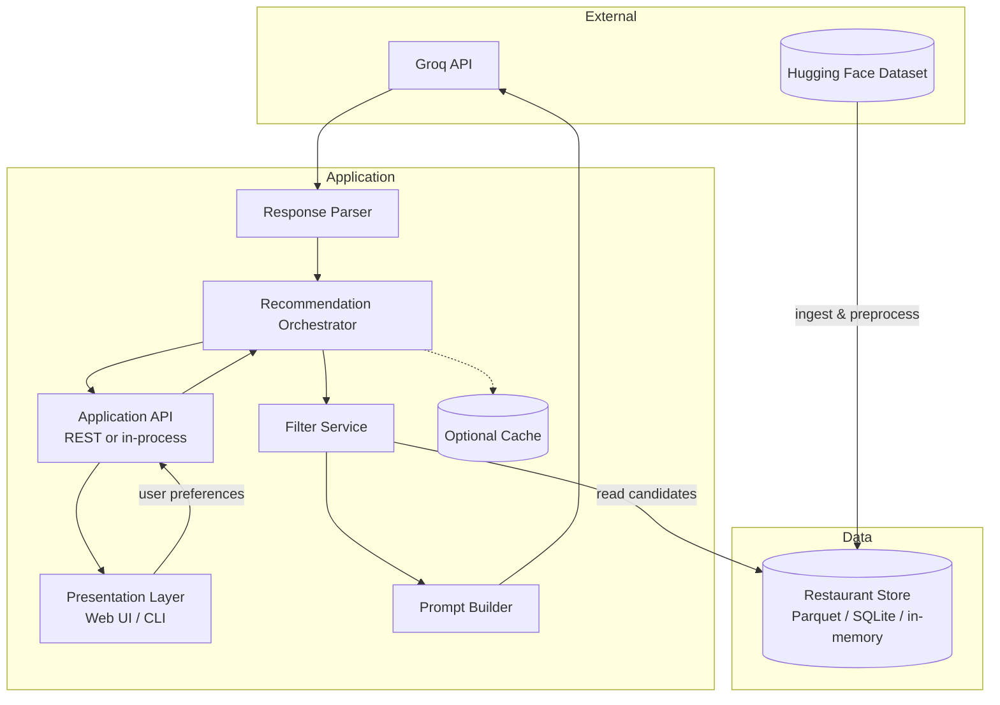
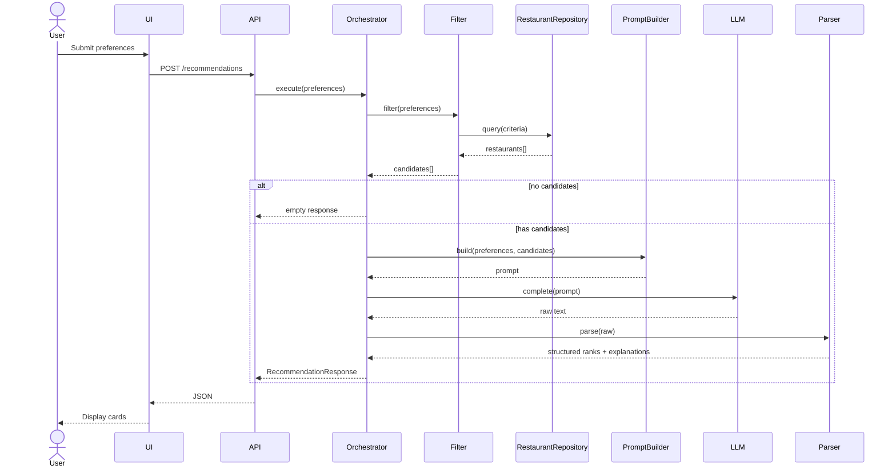

# Architecture: AI-Powered Restaurant Recommendation System

This document describes the technical architecture for the Zomato-inspired restaurant recommendation service. It is derived from [`docs/context.md`](./context.md) and defines components, data flows, interfaces, and implementation guidance for a greenfield build.

---

## Table of Contents

1. [Goals and Constraints](#goals-and-constraints)
2. [High-Level Architecture](#high-level-architecture)
3. [Logical Layers](#logical-layers)
4. [Component Design](#component-design)
5. [Data Architecture](#data-architecture)
6. [Request Lifecycle](#request-lifecycle)
7. [LLM Integration Architecture](#llm-integration-architecture)
8. [API Design](#api-design)
9. [Presentation Layer](#presentation-layer)
10. [Cross-Cutting Concerns](#cross-cutting-concerns)
11. [Proposed Repository Structure](#proposed-repository-structure)
12. [Technology Options](#technology-options)
13. [Deployment Topology](#deployment-topology)
14. [Non-Functional Requirements](#non-functional-requirements)
15. [Future Extensions](#future-extensions)

---

## Goals and Constraints

### Primary Goals

| Goal | Description |
|------|-------------|
| **Personalization** | Recommendations reflect location, budget, cuisine, rating, and free-text preferences |
| **Explainability** | Each result includes an LLM-generated rationale, not only structured fields |
| **Grounding** | Suggestions must come from the real Zomato dataset—no fabricated restaurants |
| **Usability** | Clear input form and scannable output (name, cuisine, rating, cost, explanation) |

### Architectural Constraints

- **Filter before generate**: Apply deterministic filters on structured data before calling the LLM to control cost, latency, and hallucination risk.
- **Bounded context**: Pass only a capped set of candidate restaurants into the prompt (e.g., top 20–50 after filtering).
- **Structured + generative**: Dataset fields are source of truth; LLM ranks and explains within that candidate set.
- **Single-tenant MVP**: No multi-user auth required for initial milestone; design should allow adding it later.

### Out of Scope (Initial Milestone)

- User accounts, saved favorites, or order placement
- Real-time restaurant availability or live Zomato API integration
- Fine-tuned custom models (use hosted LLM APIs)
- Geographic routing or map visualization (optional later)

---

## High-Level Architecture

The system follows a **pipeline architecture**: ingest once (or on schedule), serve many recommendation requests through filter → prompt → LLM → render.



### Architecture Style

| Aspect | Choice | Rationale |
|--------|--------|-----------|
| **Style** | Layered pipeline + orchestrator | Matches context workflow; easy to test each stage |
| **Coupling** | Orchestrator coordinates services; no direct UI → LLM | Clear boundaries, swappable LLM provider |
| **State** | Stateless request handling; restaurant data in local store | Simple deployment for learning/milestone |
| **Sync vs async** | Synchronous for MVP; async job queue optional later | User waits for recommendations in one session |

---

## Logical Layers

```
┌────────────────────────────────────────────────────────────────────────────┐
│                        PRESENTATION LAYER                                  │
│  Forms (location, budget, cuisine, rating, extras) · Results cards/list   │
└────────────────────────────────────────────────────────────────────────────┘
                                      │
                                      ▼
┌────────────────────────────────────────────────────────────────────────────┐
│                        APPLICATION / API LAYER                             │
│  Validate input · Map DTOs · Invoke orchestrator · Return JSON/view models │
└────────────────────────────────────────────────────────────────────────────┘
                                      │
                                      ▼
┌────────────────────────────────────────────────────────────────────────────┐
│                        DOMAIN / ORCHESTRATION LAYER                        │
│  RecommendationOrchestrator: filter → build prompt → LLM → parse → rank   │
└────────────────────────────────────────────────────────────────────────────┘
                                      │
                    ┌─────────────────┼─────────────────┐
                    ▼                 ▼                 ▼
┌──────────────────────┐ ┌──────────────────┐ ┌────────────────────────────┐
│   DATA ACCESS LAYER  │ │  INTEGRATION     │ │  RECOMMENDATION ENGINE     │
│   Restaurant repo    │ │  Prompt builder  │ │  LLM client + parser       │
│   Filter queries     │ │  Template mgmt   │ │  Ranking instructions      │
└──────────────────────┘ └──────────────────┘ └────────────────────────────┘
                    │
                    ▼
┌────────────────────────────────────────────────────────────────────────────┐
│                        DATA INGESTION LAYER (offline / startup)            │
│  Hugging Face loader · normalize · persist · index                         │
└────────────────────────────────────────────────────────────────────────────┘
```

---

## Component Design

### 1. Data Ingestion Pipeline

**Responsibility**: Load the Zomato dataset from Hugging Face, normalize schema, and persist for fast filtering.

| Sub-component | Role |
|---------------|------|
| `DatasetLoader` | Fetch dataset via `datasets` library or HF hub |
| `SchemaNormalizer` | Map raw columns → canonical `Restaurant` model |
| `Preprocessor` | Clean nulls, normalize location strings, parse cuisine lists, map cost to budget bands |
| `PersistenceWriter` | Write to Parquet, SQLite, or pickle for runtime reads |

**Execution modes**:

- **Startup load**: Load into memory on app boot (fine for milestone-sized data)
- **CLI ingest**: `python -m app.ingest` writes artifacts to `data/processed/`
- **Scheduled refresh**: Cron/job to re-fetch dataset (future)

**Normalization rules (examples)**:

| Raw concept | Canonical field | Notes |
|-------------|-----------------|-------|
| Restaurant name | `name: str` | Trim, dedupe key component |
| City / locality | `location: str` | Case-insensitive match for user input |
| Cuisines | `cuisines: list[str]` | Split comma-separated; lowercase |
| Cost for two / price | `estimated_cost: float` | Derive `budget_band: low \| medium \| high` via configurable thresholds |
| Aggregate rating | `rating: float` | Filter `rating >= min_rating` |
| Address, votes, etc. | optional metadata | Pass to LLM only if useful |

---

### 2. Restaurant Store & Repository

**Responsibility**: Abstract read access to preprocessed restaurants.

```text
RestaurantRepository
├── get_all() -> list[Restaurant]
├── get_by_ids(ids: list[str]) -> list[Restaurant]
├── get_distinct_localities() -> list[str]   # UI / metadata: neighbourhoods from metadata
└── filter(criteria: FilterCriteria) -> list[Restaurant]   # via FilterService in MVP
```

**FilterCriteria** (from user input):

| Field | Type | Filter logic |
|-------|------|--------------|
| `location` | `str` | Substring or exact match on city/locality (configurable) |
| `budget` | `enum` | Map to `budget_band` |
| `cuisine` | `str` | Any-match on `cuisines` list |
| `min_rating` | `float` | `rating >= min_rating` |
| `additional_preferences` | `str` | Not filtered structurally; forwarded to LLM |

**Post-filter ranking (pre-LLM)**:

- Sort by rating descending, then by votes if available
- **Cap** candidates at `MAX_CANDIDATES` (e.g., 30) before prompt construction

---

### 3. User Input Module

**Responsibility**: Collect and validate preferences at the presentation or API boundary.

**Input model** (`UserPreferences`):

```python
# Conceptual schema (language-agnostic)
UserPreferences:
  location: str              # required
  budget: Literal["low", "medium", "high"]  # required
  cuisine: str               # required
  min_rating: float           # required, e.g. 3.5
  additional_preferences: str | None  # optional free text
  top_k: int = 5             # optional, number of recommendations to return
```

**Validation**:

- Reject empty location/cuisine
- `min_rating` in [0, 5]
- Normalize strings (trim, title-case location for display)

---

### 4. Filter Service

**Responsibility**: Apply deterministic filters; return candidate list.

```text
FilterService.filter(preferences, repository) -> FilterResult
  ├── candidates: list[Restaurant]
  ├── total_before_cap: int
  └── applied_filters: dict  # for logging/debug
```

**Edge cases**:

| Scenario | Behavior |
|----------|----------|
| Zero matches after hard filters | Return empty result; UI shows message; **skip LLM call** |
| Too many matches | Cap + pre-sort by rating before LLM |
| Ambiguous location | Fuzzy match or suggest closest cities (future) |

---

### 5. Integration Layer (Prompt Builder)

**Responsibility**: Turn `UserPreferences` + `candidates` into a single LLM prompt with clear instructions.

**Prompt structure**:

1. **System message**: Role (restaurant advisor), constraints (only recommend from provided list, no inventing venues)
2. **User context**: Serialized preferences including `additional_preferences`
3. **Candidate block**: JSON or markdown table of restaurants (id, name, location, cuisines, rating, cost, budget_band)
4. **Task instructions**: Rank top N, explain each, optional one-paragraph summary
5. **Output format**: Request JSON for reliable parsing (see below)

**Example output contract** (recommended):

```json
{
  "summary": "Brief overview of the selection for this user.",
  "recommendations": [
    {
      "restaurant_id": "abc123",
      "rank": 1,
      "explanation": "Why this fits location, budget, cuisine, and extra preferences."
    }
  ]
}
```

---

### 6. Recommendation Engine (LLM Client)

**Responsibility**: Call LLM, handle retries, parse structured response, merge with dataset records.

| Sub-component | Role |
|---------------|------|
| `LLMClient` | Thin wrapper over **Groq** (primary); swappable provider interface |
| `PromptTemplates` | Versioned templates for A/B and iteration |
| `ResponseParser` | JSON parse, validate ranks/ids, fallback on malformed output |
| `RecommendationMerger` | Join LLM output with `Restaurant` entities by `restaurant_id` |

**Ranking policy**:

- **Primary**: LLM order in `recommendations[].rank`
- **Fallback**: If parse fails, return top-K by rating from filtered list with generic explanation

**Token management**:

- Send minimal fields per candidate
- Cap candidate count
- Truncate long `additional_preferences` if needed

---

### 7. Recommendation Orchestrator

**Responsibility**: Single entry point for the recommendation use case.

```text
RecommendRestaurantsUseCase.execute(preferences) -> RecommendationResponse

Steps:
  1. Validate preferences
  2. candidates = FilterService.filter(...)
  3. if candidates.empty: return empty response
  4. prompt = PromptBuilder.build(preferences, candidates)
  5. raw = LLMClient.complete(prompt)
  6. parsed = ResponseParser.parse(raw)
  7. results = Merger.merge(parsed, candidates)
  8. return RecommendationResponse(summary, results)
```

This is the **only** component the API layer should call for the main flow.

---

### 8. Output / Presentation Layer

**Responsibility**: Render `RecommendationResponse` for humans.

**Per-item view model** (`RecommendationCard`):

| Field | Source |
|-------|--------|
| Restaurant name | Dataset |
| Cuisine | Dataset (`cuisines` joined) |
| Rating | Dataset |
| Estimated cost | Dataset |
| AI explanation | LLM |
| Rank | LLM |
| Location | Dataset (optional display) |

**UI patterns**:

- Form section → loading state → results grid or list
- Show `summary` above cards if present
- Empty state and error banners

**Preference form controls** (Streamlit MVP):

| Field | Control | Data source |
|-------|---------|-------------|
| Location (area) | `selectbox` | `RestaurantRepository.get_distinct_localities()` — distinct `metadata.locality` (fallback: `metadata.listed_area`), e.g. Indiranagar, Bellandur, BTM |
| Budget | `selectbox` | `BudgetBand` enum |
| Cuisine | `text_input` (Phase 7: optional `selectbox` from distinct cuisines) | User entry or future metadata |
| Min rating | `slider` | User entry |
| Additional preferences | `text_area` | User entry |
| Top K | `number_input` | User entry |

The location dropdown value is passed to `UserPreferences.location` and matched via **case-insensitive substring** on `Restaurant.location` (unchanged filter semantics). Users pick a neighbourhood, not free-text city name.

---

## Data Architecture

### Canonical Domain Model

```text
Restaurant
├── id: str
├── name: str
├── location: str
├── cuisines: list[str]
├── rating: float
├── estimated_cost: float
├── budget_band: "low" | "medium" | "high"
└── metadata: dict (optional)

UserPreferences
├── location, budget, cuisine, min_rating
├── additional_preferences: optional str
└── top_k: int

Recommendation
├── restaurant: Restaurant
├── rank: int
└── explanation: str

RecommendationResponse
├── summary: optional str
└── recommendations: list[Recommendation]
```

### Dataset Source

| Property | Value |
|----------|-------|
| **Provider** | Hugging Face |
| **Dataset** | `ManikaSaini/zomato-restaurant-recommendation` |
| **URL** | https://huggingface.co/datasets/ManikaSaini/zomato-restaurant-recommendation |

Ingestion must **inspect actual column names** on first load and map them in `SchemaNormalizer`—do not assume column names without verification.

### Budget Band Mapping

Configurable thresholds on `estimated_cost` (example defaults—tune after exploring data):

| Band | Example rule |
|------|----------------|
| `low` | cost ≤ 500 |
| `medium` | 500 < cost ≤ 1500 |
| `high` | cost > 1500 |

User selects `budget`; filter keeps restaurants where `budget_band` matches.

---

## Request Lifecycle

### Sequence Diagram



### Latency Budget (MVP targets)

| Stage | Target |
|-------|--------|
| Filter + DB read | < 100 ms (in-memory) |
| LLM call | 2–15 s (provider-dependent) |
| Parse + merge | < 50 ms |
| **End-to-end** | Dominated by LLM; show loading indicator |

---

## LLM Integration Architecture

### Primary Provider: Groq

Phase 4 uses **[Groq](https://console.groq.com)** as the LLM provider—not OpenAI. Groq hosts fast inference for open models (Llama, Mixtral, etc.) via a dedicated API.

| Setting | Value |
|---------|-------|
| **Provider** | `groq` |
| **API base** | `https://api.groq.com/openai/v1` (OpenAI-compatible chat completions) |
| **Python SDK** | `groq` package (`Groq` client) |
| **API key env** | `GROQ_API_KEY` (mapped to `LLM_API_KEY` in app config) |
| **Default model** | `llama-3.3-70b-versatile` (balanced quality/speed) |
| **Fast alternative** | `llama-3.1-8b-instant` (lower latency, lower cost) |

**Why Groq for this milestone**

- Low-latency responses suitable for interactive recommendation UI
- Generous free tier for development
- JSON-friendly models for structured ranking output
- No OpenAI dependency or billing required

### Provider Abstraction

```text
interface LLMClient:
  complete(messages: list[Message], options: CompletionOptions) -> str
```

**MVP implementation**: `GroqClient` only.

Optional later: `MockLLMClient` (tests), or other providers behind the same interface—out of scope for initial Phase 4.

```text
GroqClient
├── reads LLM_API_KEY, LLM_MODEL from config
├── chat.completions.create(model=..., messages=..., temperature=...)
└── returns message content string for ResponseParser
```

### Prompting Principles

1. **Grounding**: Explicitly list allowed `restaurant_id` values; instruct model not to add restaurants outside the list.
2. **Preference-aware ranking**: Weight location and cuisine heavily; use `additional_preferences` for tie-breaking and tone.
3. **Structured output**: Request JSON in the prompt; use Groq `response_format` / JSON mode when the selected model supports it.
4. **Determinism vs creativity**: Low temperature (0.2–0.5) for stable rankings; slightly higher for explanation prose if desired.

### Failure Handling

| Failure | Mitigation |
|---------|------------|
| API timeout | Retry once with backoff; then fallback ranking |
| Invalid JSON | Regex extract JSON block; else rating-based fallback |
| Unknown `restaurant_id` in response | Drop entry; log warning |
| Rate limit (Groq 429) | Retry once with backoff; then fallback ranking |
| Invalid Groq API key | Fail with clear config error at startup or first call |

### Cost Control

- Hard cap on candidates sent to LLM
- Cache responses keyed by hash of `(preferences, candidate_ids)` optional
- Batch ingest offline; never call LLM during ingest

---

## API Design

### REST Endpoints (if web/API split)

| Method | Path | Description |
|--------|------|-------------|
| `POST` | `/api/v1/recommendations` | Generate recommendations from body |
| `GET` | `/api/v1/health` | Liveness |
| `GET` | `/api/v1/metadata/locations` | Distinct localities/areas for location dropdown (from `metadata.locality` / `listed_area`) |
| `GET` | `/api/v1/metadata/cuisines` | Optional: distinct cuisines for dropdown |

### Request / Response

**Request body**:

```json
{
  "location": "Indiranagar",
  "budget": "medium",
  "cuisine": "Italian",
  "min_rating": 4.0,
  "additional_preferences": "family-friendly, quick service",
  "top_k": 5
}
```

**Response body**:

```json
{
  "summary": "Five strong Italian options in Bangalore within a medium budget.",
  "recommendations": [
    {
      "rank": 1,
      "restaurant": {
        "id": "r1",
        "name": "Example Bistro",
        "location": "Indiranagar",
        "cuisines": ["Italian", "Continental"],
        "rating": 4.5,
        "estimated_cost": 1200,
        "budget_band": "medium"
      },
      "explanation": "Highly rated Italian restaurant matching your budget and family-friendly preference."
    }
  ],
  "meta": {
    "candidates_considered": 28,
    "filters_applied": ["location", "budget", "cuisine", "min_rating"]
  }
}
```

**Error responses**: `400` validation, `502` LLM upstream failure, `503` if store not loaded.

---

## Presentation Layer

### Option A: Streamlit (fastest milestone)

- Single Python app: form + `st.spinner` + result cards
- Calls orchestrator in-process (no separate API)

### Option B: React + FastAPI

- FastAPI implements API layer; React form and results page
- Better separation for portfolio/demo

### UI Flow

```text
[Preference Form] → [Submit] → [Loading] → [Summary (optional)] → [Recommendation Cards × top_k]
```

Form fields map 1:1 to `UserPreferences`. **Location** and **budget** use `selectbox` options from the repository (localities from ingested metadata; budget from `BudgetBand`). Cuisine remains free-text in MVP; optional cuisine dropdown uses distinct values from the dataset. FastAPI path exposes the same locality list via `GET /api/v1/metadata/locations`.

---

## Cross-Cutting Concerns

### Configuration

Environment-driven settings:

| Variable | Purpose |
|----------|---------|
| `LLM_PROVIDER` | `groq` (default; only provider in MVP) |
| `LLM_API_KEY` | Groq API key ([console.groq.com](https://console.groq.com)) |
| `LLM_MODEL` | Groq model id, e.g. `llama-3.3-70b-versatile` |
| `GROQ_API_KEY` | Optional alias; app may read this if `LLM_API_KEY` unset |
| `DATA_PATH` | Processed restaurant artifact path |
| `MAX_CANDIDATES` | Cap before LLM |
| `BUDGET_LOW_MAX`, etc. | Band thresholds |

Use `.env` locally; never commit secrets.

### Logging & Observability

- Log filter counts, prompt token estimate, LLM latency, parse success/failure
- Correlation id per request for debugging
- Optional: log prompt/response redacted in dev only

### Security

- Validate and sanitize all user strings (max length on `additional_preferences`)
- No SQL from user input—parameterized queries or in-memory filter only
- Rate-limit public API if deployed

### Testing Strategy

| Layer | Test type |
|-------|-----------|
| `SchemaNormalizer` | Unit tests with sample HF rows |
| `FilterService` | Unit tests for each filter dimension |
| `PromptBuilder` | Snapshot tests for prompt shape |
| `ResponseParser` | Unit tests with valid/invalid LLM JSON |
| Orchestrator | Integration test with mocked LLM |
| E2E | One golden path with recorded LLM fixture |

---

## Proposed Repository Structure

```text
zomato-milestone/
├── docs/
│   ├── context.md
│   ├── problemStatement.txt
│   └── architecture.md          # this file
├── data/
│   ├── raw/                     # optional HF download cache
│   └── processed/               # parquet / sqlite after ingest
├── src/
│   └── app/
│       ├── __init__.py
│       ├── main.py              # entry (FastAPI / Streamlit)
│       ├── config.py
│       ├── models/              # Restaurant, UserPreferences, etc.
│       ├── ingestion/
│       │   ├── loader.py
│       │   ├── normalizer.py
│       │   └── pipeline.py
│       ├── data/
│       │   └── repository.py
│       ├── services/
│       │   ├── filter_service.py
│       │   ├── prompt_builder.py
│       │   ├── llm_client.py
│       │   ├── response_parser.py
│       │   └── orchestrator.py
│       └── api/
│           ├── routes.py
│           └── schemas.py
├── tests/
├── scripts/
│   └── ingest.py
├── .env.example
├── requirements.txt
└── README.md
```

---

## Technology Options

Recommended stack for a Python-centric milestone (choose one path):

| Concern | Option A (rapid) | Option B (production-shaped) |
|---------|------------------|------------------------------|
| Runtime | Python 3.11+ | Python 3.11+ |
| UI | Streamlit | React + Vite |
| API | In-process | FastAPI |
| Data load | `datasets`, `pandas` | Same |
| Storage | In-memory / Parquet | SQLite |
| LLM | **Groq API** (`groq` SDK, Llama models) | Same |
| Config | `pydantic-settings` | Same |

---

## Deployment Topology

### Local Development

```text
Developer machine
├── .env (API keys)
├── processed data in data/processed/
└── streamlit run app  OR  uvicorn + npm dev
```

### Simple Cloud (optional)

```text
[User Browser] → [Reverse Proxy] → [App Container]
                         │
                         ├── Volume: processed dataset
                         └── Secrets: LLM_API_KEY
```

No database server required for MVP if using file-backed or in-memory store.

---

## Non-Functional Requirements

| NFR | Target (MVP) |
|-----|----------------|
| **Availability** | Best-effort; depends on LLM provider |
| **Scalability** | Single instance; horizontal scale not required |
| **Maintainability** | Clear layer boundaries per this doc |
| **Reliability** | Graceful degradation when LLM fails |
| **Privacy** | No PII stored; preferences only in flight |

---

## Future Extensions

- **Vector retrieval**: Embed `additional_preferences` and restaurant descriptions for semantic pre-filter
- **Conversation**: Multi-turn refinement (“cheaper”, “ nearer Indiranagar”)
- **Feedback loop**: Thumbs up/down to tune prompts
- **Auth & history**: Save past searches per user
- **Maps**: Link to Google Maps from address field
- **Observability**: OpenTelemetry traces across filter and LLM spans

---

## References

- Project context: [`docs/context.md`](./context.md)
- Problem statement: [`docs/problemStatement.txt`](./problemStatement.txt)
- Dataset: https://huggingface.co/datasets/ManikaSaini/zomato-restaurant-recommendation
