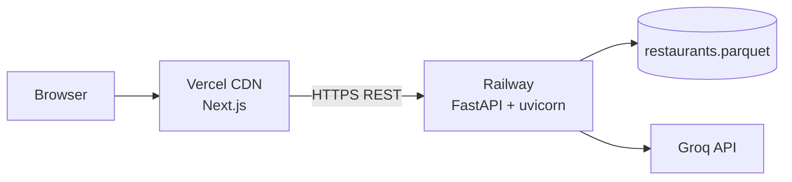

# Deployment Plan — Railway (Backend) + Vercel (Frontend)

Deploy **TasteTrail AI** as a split stack:

| Layer | Platform | What runs |
|-------|----------|-----------|
| **Frontend** | [Vercel](https://vercel.com) | Next.js app in `frontend/` |
| **Backend** | [Railway](https://railway.com) | FastAPI (`api/main.py`) + Groq LLM + Parquet data |

**Related docs**: [`architecture.md`](./architecture.md#deployment-topology), [`README.md`](../README.md) (local dev).

---

## Architecture



| Endpoint | Method | Purpose |
|----------|--------|---------|
| `/api/v1/health` | GET | Liveness + restaurant count |
| `/api/v1/metadata/locations` | GET | Area dropdown options |
| `/api/v1/recommendations` | POST | Generate recommendations |

Frontend calls the API via `NEXT_PUBLIC_API_URL` (see `frontend/src/lib/api.ts`).

---

## Overview

| Item | Backend (Railway) | Frontend (Vercel) |
|------|-------------------|-------------------|
| **Source** | Repo root | `frontend/` subdirectory |
| **Runtime** | Python 3.11+ | Node.js 20+ |
| **Entry** | `uvicorn api.main:app` | `next build` / `next start` |
| **Dependencies** | `requirements-api.txt` (recommended) or `requirements-dev.txt` | `frontend/package.json` |
| **Secrets** | Groq key, `CORS_ALLOWED_ORIGINS` | `NEXT_PUBLIC_API_URL` |
| **Data** | `data/processed/restaurants.parquet` in image/repo | None (API only) |

---

## Prerequisites

1. **GitHub repo** pushed (e.g. [saksham20189575/zomato-milestone](https://github.com/saksham20189575/zomato-milestone)).
2. **Groq API key** from [Groq Console](https://console.groq.com).
3. **Processed data** in the repo:
   ```bash
   pip install -r requirements-dev.txt
   python scripts/ingest.py
   git add data/processed/restaurants.parquet
   git commit -m "Add processed restaurant data for deploy"
   git push
   ```
4. **Local smoke test** (both terminals):
   ```bash
   # Terminal 1 — API
   pip install -r requirements-dev.txt
   cp .env.example .env   # set LLM_API_KEY
   PYTHONPATH=src uvicorn api.main:app --reload --port 8000

   # Terminal 2 — Frontend
   cd frontend
   cp .env.local.example .env.local
   npm install && npm run dev
   ```
   Open [http://localhost:3000](http://localhost:3000) and submit a recommendation.

5. **Production CORS** — `api/main.py` must allow your Vercel origin(s). Use env-based origins (see [Railway environment variables](#railway-environment-variables)). Default local origins: `http://localhost:3000`, `http://127.0.0.1:3000`.

---

## Pre-deployment checklist

| # | Task | Backend | Frontend |
|---|------|---------|----------|
| 1 | `restaurants.parquet` committed to `main` | ✓ | — |
| 2 | Groq key set in platform secrets (not in git) | ✓ | — |
| 3 | Railway service exposes HTTPS URL | ✓ | — |
| 4 | `NEXT_PUBLIC_API_URL` = Railway URL (no trailing slash) | — | ✓ |
| 5 | `CORS_ALLOWED_ORIGINS` includes Vercel URL | ✓ | — |
| 6 | Health check returns `"status": "ok"` | ✓ | — |

---

## 1. Backend on Railway

### 1.1 Create project

1. Sign in at [railway.app](https://railway.app) → **New Project** → **Deploy from GitHub repo**.
2. Select `zomato-milestone` and branch `main`.
3. Railway creates a service from the repo root.

### 1.2 Build & start commands

The repo includes **`railway.toml`** (Docker build) and **`Dockerfile`**:

| File | Purpose |
|------|---------|
| `railway.toml` | `builder = "DOCKERFILE"`, health check `/api/v1/health` |
| `Dockerfile` | Python 3.11 image, `requirements-api.txt`, uvicorn via `scripts/start-api.sh` |
| `scripts/start-api.sh` | `PYTHONPATH=src uvicorn api.main:app --host 0.0.0.0 --port $PORT` |
| `requirements-api.txt` | Core + FastAPI deps (no Streamlit / Hugging Face `datasets`) |

Railway only accepts `RAILPACK` or `DOCKERFILE` as builders — this project uses **DOCKERFILE** (not `NIXPACKS`).

| Setting | Value |
|---------|--------|
| **Root directory** | `/` (repository root) |

### 1.3 Railway environment variables

In **Variables** (or **Shared Variables**):

| Variable | Required | Example | Notes |
|----------|----------|---------|--------|
| `LLM_API_KEY` or `GROQ_API_KEY` | **Yes** | `gsk_...` | Groq authentication |
| `LLM_MODEL` | No | `llama-3.3-70b-versatile` | Default in `config.py` |
| `LLM_TEMPERATURE` | No | `0.3` | |
| `LLM_MAX_RETRIES` | No | `1` | |
| `DATA_PATH` | No | `data/processed/restaurants.parquet` | Relative to repo root |
| `MAX_CANDIDATES` | No | `30` | |
| `BUDGET_LOW_MAX` | No | `500` | |
| `BUDGET_MEDIUM_MAX` | No | `1500` | |
| `CORS_ALLOWED_ORIGINS` | **Yes** (prod) | `https://your-app.vercel.app` | Comma-separated; include preview URLs if needed |

**CORS example** (after Vercel is deployed):

```text
CORS_ALLOWED_ORIGINS=https://tastetrail.vercel.app,https://tastetrail-*.vercel.app,http://localhost:3000
```

> `api/main.py` reads `CORS_ALLOWED_ORIGINS` via `settings.cors_origin_list` in `app/config.py`. Without your Vercel URL in this list, the browser will block API calls.

### 1.4 Networking

1. Open the service → **Settings** → **Networking** → **Generate domain** (e.g. `zomato-milestone-production.up.railway.app`).
2. Copy the **HTTPS** URL — this is your API base for Vercel.

### 1.5 Verify backend

```bash
curl https://YOUR-RAILWAY-DOMAIN.up.railway.app/api/v1/health
# Expected: {"status":"ok","restaurants_loaded":"25865"}  (count may vary)

curl https://YOUR-RAILWAY-DOMAIN.up.railway.app/api/v1/metadata/locations
# Expected: JSON with "locations": ["Bellandur", ...]
```

Check **Deploy logs** if `status` is `degraded` (parquet missing or path wrong).

---

## 2. Frontend on Vercel

### 2.1 Import project

1. Sign in at [vercel.com](https://vercel.com) → **Add New** → **Project**.
2. Import the same GitHub repository.
3. Set **Root Directory** to `frontend` (important).

### 2.2 Framework settings

Vercel should auto-detect **Next.js**. The repo includes **`frontend/vercel.json`** and **`frontend/.npmrc`** (public npm registry):

| Setting | Value |
|---------|--------|
| **Framework Preset** | Next.js |
| **Build Command** | `npm run build` |
| **Install Command** | `npm ci` |

> **Note:** `package-lock.json` must use `registry.npmjs.org` URLs. Lockfiles generated against a corporate registry (e.g. Intuit Artifactory) will fail on Vercel with `npm install` errors.

### 2.3 Vercel environment variables

In **Project → Settings → Environment Variables**:

| Name | Value | Environments |
|------|--------|--------------|
| `NEXT_PUBLIC_API_URL` | `https://YOUR-RAILWAY-DOMAIN.up.railway.app` | Production, Preview, Development |

- No trailing slash on the URL.
- Redeploy after changing this variable (build-time embed for Next.js public env).

Optional for local Vercel CLI:

```bash
# frontend/.env.local
NEXT_PUBLIC_API_URL=https://YOUR-RAILWAY-DOMAIN.up.railway.app
```

### 2.4 Deploy

Click **Deploy**. Note the production URL, e.g. `https://zomato-milestone.vercel.app`.

### 2.5 Wire CORS on Railway

Return to Railway and set:

```text
CORS_ALLOWED_ORIGINS=https://zomato-milestone.vercel.app,http://localhost:3000
```

Add preview deployments if you use them:

```text
https://zomato-milestone-*.vercel.app
```

Wildcard patterns such as `https://*.vercel.app` are supported via `allow_origin_regex` in `api/main.py` (see `settings.cors_origin_regex`).

Redeploy or restart the Railway service after updating variables.

### 2.6 Verify frontend

1. Open the Vercel production URL.
2. Confirm the **Area** dropdown loads (calls `/api/v1/metadata/locations`).
3. Submit preferences → loading state → recommendation cards.
4. If the dropdown is empty or submit fails, open browser **DevTools → Network**:
   - **CORS error** → fix `CORS_ALLOWED_ORIGINS` on Railway.
   - **502/503** → check Railway logs and Groq key.
   - **Failed to fetch** → wrong `NEXT_PUBLIC_API_URL` or Railway service down.

---

## Configuration reference

### Backend (`app.config.Settings` + Railway)

| Variable | Required | Default | Purpose |
|----------|----------|---------|---------|
| `LLM_API_KEY` / `GROQ_API_KEY` | **Yes** | — | Groq API |
| `LLM_PROVIDER` | No | `groq` | |
| `LLM_MODEL` | No | `llama-3.3-70b-versatile` | |
| `LLM_TEMPERATURE` | No | `0.3` | |
| `LLM_MAX_RETRIES` | No | `1` | |
| `DATA_PATH` | No | `data/processed/restaurants.parquet` | |
| `MAX_CANDIDATES` | No | `30` | |
| `BUDGET_LOW_MAX` | No | `500` | |
| `BUDGET_MEDIUM_MAX` | No | `1500` | |
| `CORS_ALLOWED_ORIGINS` | **Yes** (prod) | localhost only | Comma-separated browser origins |
| `PORT` | Auto on Railway | `8000` | Set by Railway |

See [`.env.example`](../.env.example) for local development.

### Frontend (Vercel)

| Variable | Required | Default | Purpose |
|----------|----------|---------|---------|
| `NEXT_PUBLIC_API_URL` | **Yes** (prod) | `http://localhost:8000` | Railway API base URL |

---

## Data on Railway

`data/processed/restaurants.parquet` (~3.6 MB) should be **in the repository** (gitignored except `restaurants.parquet`). Railway builds from the repo clone; no Hugging Face ingest at runtime.

| Strategy | When to use |
|----------|-------------|
| **Commit parquet** (recommended) | Fast deploys, stable demos |
| **Railway volume** | Larger datasets or frequent updates without git |
| **Build-time ingest** | Only if you add `datasets` and run `scripts/ingest.py` in the build step (slow) |

---

## Security and operations

| Topic | Guidance |
|-------|----------|
| **Secrets** | Groq key only in Railway/Vercel env; never commit `.env` |
| **HTTPS** | Both platforms provide TLS by default |
| **CORS** | Allow only your Vercel production + preview origins |
| **Rate limits** | Groq free tier may throttle public demos |
| **Logs** | Railway → service → **Logs**; Vercel → **Deployments → Logs** |
| **Cold start** | Railway free/hobby tiers may sleep; first request slower |
| **Updates** | Push to `main` → auto-redeploy both services |

---

## Troubleshooting

| Symptom | Likely cause | Fix |
|---------|----------------|-----|
| CORS error in browser | Vercel origin not allowed | Set `CORS_ALLOWED_ORIGINS` on Railway |
| `Failed to fetch` / network error | Wrong `NEXT_PUBLIC_API_URL` | Match Railway HTTPS URL; redeploy Vercel |
| Area dropdown empty | API 503 or CORS blocked | Check `/api/v1/metadata/locations` with curl |
| `status: degraded` on health | Parquet missing in deploy | Commit `data/processed/restaurants.parquet` |
| 502 on recommendations | Groq key missing/invalid | Set `LLM_API_KEY` on Railway |
| `ModuleNotFoundError: app` | Wrong start command | Use `PYTHONPATH=src uvicorn api.main:app ...` |
| Vercel build fails | Wrong root directory | Set root to `frontend` |
| `npm install` / Exit handler never called | Lockfile points to private registry | Regenerate lockfile with `frontend/.npmrc`; commit updated `package-lock.json` |
| Works locally, fails in prod | Secrets only in local `.env` | Copy vars to Railway + Vercel |

---

## Deployment timeline (suggested)

| Step | Effort |
|------|--------|
| Commit parquet + push | 10 min |
| Railway service + env + domain | 20 min |
| Vercel project + `NEXT_PUBLIC_API_URL` | 15 min |
| CORS + end-to-end QA | 15 min |
| **Total** | ~1 hour |

---

## Dockerfile reference

The root `Dockerfile` is used automatically via `railway.toml`. To build locally:

```bash
docker build -t tastetrail-api .
docker run -p 8000:8000 -e LLM_API_KEY="gsk_..." -e PORT=8000 tastetrail-api
```

---

## Alternative: Streamlit Community Cloud

A standalone Streamlit UI (`streamlit_app.py` / `src/app/main.py`) can still be deployed without Railway/Vercel. That path uses in-process orchestration (no FastAPI).

| Item | Value |
|------|--------|
| Platform | [share.streamlit.io](https://share.streamlit.io) |
| Main file | `streamlit_app.py` |
| Dependencies | `requirements.txt` → `requirements-streamlit.txt` |
| Secrets | Groq keys in Streamlit **Secrets** TOML |
| Data | `data/processed/restaurants.parquet` in repo |
| Known fix | Do not eager-import `datasets` in `app.ingestion.__init__` (runtime reads parquet only) |

Run locally:

```bash
streamlit run streamlit_app.py
```

---

## Out of scope

- Custom domains (supported by both platforms; configure in their dashboards).
- Auth / API keys on public endpoints.
- Managed Postgres or Redis (not required for MVP).
- CI/CD pipelines beyond Git-triggered deploys.

For system design context, see [Deployment Topology](./architecture.md#deployment-topology).
