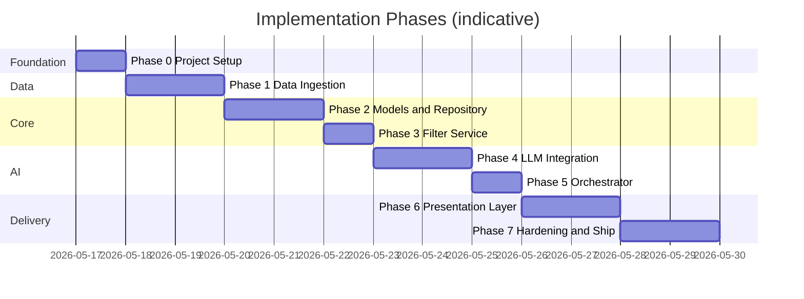
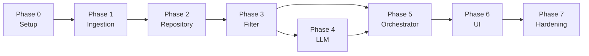

# Phase-Wise Implementation Plan

This plan breaks the AI-powered restaurant recommendation system into sequential phases. Each phase maps to components in [`architecture.md`](./architecture.md) and deliverables in [`context.md`](./context.md).

**Recommended stack (MVP)**: Python 3.11+, Streamlit UI, in-memory/Parquet store, **Groq** for LLM (not OpenAI). FastAPI + React can replace Phases 6–7 if you choose Option B from the architecture doc.

---

## Plan Overview



| Phase | Name | Primary outcome | Depends on |
|-------|------|-----------------|------------|
| 0 | Project setup | Runnable repo, config, tooling | — |
| 1 | Data ingestion | Clean `Restaurant` dataset on disk | 0 |
| 2 | Models & repository | Load and query restaurants in code | 1 |
| 3 | Filter service | Deterministic candidate shortlist | 2 |
| 4 | LLM integration | Ranked + explained JSON from model | 3 |
| 5 | Orchestrator | Single `execute(preferences)` entry point | 3, 4 |
| 6 | Presentation layer | End-to-end UI for users | 5 |
| 7 | Hardening & ship | Tests, docs, demo-ready app | 6 |

**Estimated total**: 10–14 working days for one developer (adjust if using FastAPI + React).

---

## Phase 0: Project Setup & Foundation

**Goal**: Establish repository layout, dependencies, configuration, and development workflow before writing business logic.

### Architecture alignment

- [Proposed Repository Structure](./architecture.md#proposed-repository-structure)
- [Cross-Cutting: Configuration](./architecture.md#configuration)

### Tasks

| # | Task | Details |
|---|------|---------|
| 0.1 | Initialize Python project | `src/app/` package, `pyproject.toml` or `requirements.txt` |
| 0.2 | Create directory scaffold | `data/raw`, `data/processed`, `tests/`, `scripts/` per architecture |
| 0.3 | Add core dependencies | `datasets`, `pandas`, `pydantic`, `pydantic-settings`, `python-dotenv` |
| 0.4 | Implement `config.py` | Load `DATA_PATH`, `MAX_CANDIDATES`, budget thresholds, LLM settings from env |
| 0.5 | Add `.env.example` | Document Groq settings: `LLM_PROVIDER=groq`, `LLM_API_KEY` (Groq key), `LLM_MODEL`, `DATA_PATH`, etc. |
| 0.6 | Configure logging | Basic structured logger; correlation id hook for later |
| 0.7 | Set up testing | `pytest`, `tests/conftest.py`, one smoke test |
| 0.8 | Write minimal `README.md` | Setup, ingest command, run command |

### Deliverables

- [ ] `pip install -e .` or `pip install -r requirements.txt` succeeds
- [ ] `pytest` runs (even if only smoke tests)
- [ ] `.env.example` committed; `.env` gitignored

### Exit criteria

- Project imports as `app` without errors
- Configuration reads from environment with sensible defaults

---

## Phase 1: Data Ingestion Pipeline

**Goal**: Load the Hugging Face Zomato dataset, normalize to canonical schema, persist processed artifacts.

### Architecture alignment

- [Component 1: Data Ingestion Pipeline](./architecture.md#1-data-ingestion-pipeline)
- [Data Architecture](./architecture.md#data-architecture)
- Context: [Data Source](./context.md#data-source)

### Tasks

| # | Task | Details |
|---|------|---------|
| 1.1 | Explore raw dataset | Load `ManikaSaini/zomato-restaurant-recommendation`; print schema, sample rows, null rates |
| 1.2 | Define domain models | `Restaurant`, `BudgetBand` in `models/` using Pydantic |
| 1.3 | Implement `DatasetLoader` | Fetch via `datasets` library; convert to DataFrame |
| 1.4 | Implement `SchemaNormalizer` | Map **actual** column names → canonical fields (do not guess) |
| 1.5 | Implement `Preprocessor` | Trim strings, parse cuisines, drop invalid ratings, assign stable `id` |
| 1.6 | Derive `budget_band` | Apply configurable thresholds (`BUDGET_LOW_MAX`, etc.) |
| 1.7 | Implement `PersistenceWriter` | Write Parquet (or pickle) to `data/processed/restaurants.parquet` |
| 1.8 | CLI ingest script | `python scripts/ingest.py` or `python -m app.ingestion.pipeline` |
| 1.9 | Unit tests | Normalizer tests with 3–5 fixture rows representing edge cases |

### Deliverables

- [ ] Processed file under `data/processed/`
- [ ] Documented column mapping in code comments or ingest README snippet
- [ ] Log line: total records ingested, dropped, per-city counts (optional)

### Exit criteria

- Ingest is **idempotent** (re-run overwrites safely)
- Sample inspection shows sensible `name`, `location`, `cuisines`, `rating`, `estimated_cost`, `budget_band`
- At least 1000+ usable rows (exact count depends on dataset)

### Risks & mitigations

| Risk | Mitigation |
|------|------------|
| Unexpected column names | Phase 1.1 exploration before mapping |
| Missing cost/rating fields | Drop or impute with documented rules |
| Duplicate restaurants | Dedupe on `(name, location)` when generating `id` |

---

## Phase 2: Domain Models & Restaurant Repository

**Goal**: Runtime access to preprocessed restaurants via a clean repository API.

### Architecture alignment

- [Component 2: Restaurant Store & Repository](./architecture.md#2-restaurant-store--repository)
- [Canonical Domain Model](./architecture.md#canonical-domain-model)

### Tasks

| # | Task | Details |
|---|------|---------|
| 2.1 | Finalize `UserPreferences` model | location, budget, cuisine, min_rating, additional_preferences, top_k |
| 2.2 | Add validation helpers | Empty string checks, `min_rating` in [0, 5] |
| 2.3 | Implement `RestaurantRepository` | Load from `DATA_PATH` at startup |
| 2.4 | Implement `get_all()` | Return full in-memory list |
| 2.5 | Implement `get_by_ids()` | For LLM merge step later |
| 2.6 | Define `FilterCriteria` | Derived from `UserPreferences` (exclude free-text from structural filter) |
| 2.7 | Repository integration test | Load real processed file; assert count > 0 |

### Deliverables

- [ ] `models/restaurant.py`, `models/preferences.py`, `models/recommendation.py` (stubs for response OK)
- [ ] `data/repository.py` with load-on-init pattern

### Exit criteria

- `repository.get_all()` returns typed `Restaurant` instances
- App fails fast with clear error if processed data file is missing

---

## Phase 3: Filter Service

**Goal**: Deterministic filtering and pre-LLM candidate capping—no LLM calls in this phase.

### Architecture alignment

- [Component 4: Filter Service](./architecture.md#4-filter-service)
- Context: [Integration Layer — Filter](./context.md#3-integration-layer)
- Constraint: [Filter before generate](./architecture.md#architectural-constraints)

### Tasks

| # | Task | Details |
|---|------|---------|
| 3.1 | Implement `FilterService.filter()` | Accept `UserPreferences` + repository |
| 3.2 | Location filter | Case-insensitive substring match on `location` |
| 3.3 | Budget filter | Match `budget` enum to `budget_band` |
| 3.4 | Cuisine filter | Any-match against `cuisines` list |
| 3.5 | Min rating filter | `rating >= min_rating` |
| 3.6 | Post-filter sort | Rating desc; votes if in metadata |
| 3.7 | Cap candidates | Respect `MAX_CANDIDATES` from config |
| 3.8 | Return `FilterResult` | candidates, total_before_cap, applied_filters |
| 3.9 | Unit tests | One test per filter dimension + empty result + cap behavior |
| 3.10 | CLI/debug script | Print candidates for a sample preference set (no LLM) |

### Deliverables

- [ ] `services/filter_service.py`
- [ ] Test coverage for all filter dimensions

### Exit criteria

- Given preferences, returns only matching restaurants, capped and sorted
- Zero candidates returns empty list without error
- `additional_preferences` is **not** used for structural filtering (reserved for LLM)

### Manual validation checklist

- [ ] Bangalore + medium + Italian + 4.0 returns plausible subset
- [ ] Impossible combo returns `[]`
- [ ] Cap enforced when matches > `MAX_CANDIDATES`

---

## Phase 4: LLM Integration Layer

**Goal**: Build prompt, call **Groq**, parse JSON, merge with dataset records—including fallback when the model fails.

**LLM provider**: [Groq](https://console.groq.com) — not OpenAI. See [Primary Provider: Groq](./architecture.md#primary-provider-groq) in the architecture doc.

### Architecture alignment

- [Component 5: Integration Layer (Prompt Builder)](./architecture.md#5-integration-layer-prompt-builder)
- [Component 6: Recommendation Engine](./architecture.md#6-recommendation-engine-llm-client)
- [LLM Integration Architecture](./architecture.md#llm-integration-architecture)
- [Primary Provider: Groq](./architecture.md#primary-provider-groq)

### Environment (Groq)

```bash
LLM_PROVIDER=groq
LLM_API_KEY=<your-groq-api-key>   # from https://console.groq.com
LLM_MODEL=llama-3.3-70b-versatile
```

Add `groq` to `requirements.txt`. Use `Groq` Python client for chat completions.

### Tasks

| # | Task | Details |
|---|------|---------|
| 4.1 | Define `LLMClient` interface | `complete(messages) -> str` |
| 4.2 | Implement `GroqClient` | Primary provider via `groq` SDK; read `LLM_API_KEY`, `LLM_MODEL`; handle timeouts/429 |
| 4.3 | Implement `PromptBuilder` | System + user context + candidate JSON + output schema |
| 4.4 | Grounding instructions | Only recommend listed `restaurant_id`s; no invented venues |
| 4.5 | Request structured JSON output | JSON in prompt + Groq JSON mode when model supports it |
| 4.6 | Implement `ResponseParser` | Parse JSON; extract JSON block on failure |
| 4.7 | Validate parsed output | Ranks, known IDs, count ≤ top_k |
| 4.8 | Implement `RecommendationMerger` | Join LLM output with `Restaurant` by id |
| 4.9 | Fallback path | Rating-based top-K + generic explanation if parse/API fails |
| 4.10 | Retry logic | One retry on Groq timeout or rate limit (429) |
| 4.11 | Unit tests | Parser with valid/invalid/malformed fixtures; prompt snapshot test; mock Groq (no live API in CI) |
| 4.12 | Integration test | Mock LLM returns fixed JSON; assert merged `Recommendation` list |
| 4.13 | Optional live smoke test | `@pytest.mark.integration` calling real Groq when `LLM_API_KEY` set |

### Deliverables

- [ ] `services/prompt_builder.py`, `llm_client.py` (with `GroqClient`), `response_parser.py`, `merger.py`
- [ ] `groq` in `requirements.txt`; `.env.example` defaults to `LLM_PROVIDER=groq`
- [ ] Recorded mock LLM fixture in `tests/fixtures/`

### Exit criteria

- Mocked end-to-end: preferences → filter → prompt → mock LLM → parsed `RecommendationResponse`
- Fallback produces top-K by rating when parser fails
- No restaurant appears in output that was not in the candidate list

### Prompt iteration checklist

- [ ] Explanations mention location, budget, cuisine
- [ ] `additional_preferences` reflected in explanations when provided
- [ ] Optional `summary` field populated

### Groq-specific notes

- Default model: `llama-3.3-70b-versatile`; swap to `llama-3.1-8b-instant` for faster/cheaper runs
- Do not implement OpenAI client in Phase 4 unless extending the provider abstraction later
- CI must use **mocked** Groq responses; live Groq tests are optional and skipped without API key

---

## Phase 5: Recommendation Orchestrator

**Goal**: Single use-case entry point wiring filter → prompt → LLM → parse → merge.

### Architecture alignment

- [Component 7: Recommendation Orchestrator](./architecture.md#7-recommendation-orchestrator)
- [Request Lifecycle](./architecture.md#request-lifecycle)

### Tasks

| # | Task | Details |
|---|------|---------|
| 5.1 | Implement `RecommendRestaurantsUseCase.execute()` | Full pipeline per architecture sequence |
| 5.2 | Short-circuit empty candidates | Skip LLM; return empty `RecommendationResponse` with meta |
| 5.3 | Build `RecommendationResponse` | summary + recommendations + meta (candidates_considered, filters_applied) |
| 5.4 | Add logging | Filter count, LLM latency, parse success/failure |
| 5.5 | Integration test | Full flow with mocked LLM |
| 5.6 | Optional: wire real LLM smoke test | Marked `@pytest.mark.integration`, skipped in CI without key |

### Deliverables

- [ ] `services/orchestrator.py`
- [ ] `Recommendation`, `RecommendationResponse` models complete

### Exit criteria

- One function call from preferences to final response
- Meta block explains how many candidates were considered
- Orchestrator is the **only** entry point the UI/API will call

---

## Phase 6: Presentation Layer

**Goal**: User-facing app—preference form, loading state, recommendation cards with all required fields.

### Architecture alignment

- [Component 8: Output / Presentation Layer](./architecture.md#8-output--presentation-layer)
- [Presentation Layer options](./architecture.md#presentation-layer)
- Context: [Output Display](./context.md#5-output-display)

### Path A — Streamlit (recommended for speed)

| # | Task | Details |
|---|------|---------|
| 6A.1 | Preference form | **location (selectbox)** from `get_distinct_localities()` (Indiranagar, Bellandur, BTM, …); budget (select); cuisine, min_rating (slider), additional (text), top_k |
| 6A.1a | Location metadata API (in-process) | `RestaurantRepository.get_distinct_localities()` reads `metadata.locality` / `listed_area`; UI must not default to free-text city only (e.g. Bangalore) |
| 6A.2 | Submit handler | Call orchestrator in-process |
| 6A.3 | Loading state | `st.spinner` during LLM call |
| 6A.4 | Results UI | Card per recommendation: name, cuisine, rating, cost, explanation, rank |
| 6A.5 | Summary block | Show LLM summary when present |
| 6A.6 | Empty state | Message when no candidates |
| 6A.7 | Error state | Friendly message on LLM failure (fallback results still shown if any) |

### Path B — FastAPI + React (optional)

| # | Task | Details |
|---|------|---------|
| 6B.1 | FastAPI `POST /api/v1/recommendations` | Request/response schemas per architecture |
| 6B.2 | `GET /api/v1/health` | Liveness |
| 6B.3 | Optional metadata endpoints | locations, cuisines for dropdowns |
| 6B.4 | React form + results page | Call API; display cards |
| 6B.5 | CORS and env-based API URL | Local dev setup |

### Deliverables

- [ ] Runnable UI: `streamlit run src/app/main.py` (or equivalent)
- [ ] All context output fields visible per recommendation

### Exit criteria

- Demo flow: enter preferences → see top-K cards with AI explanations
- Matches context success criteria: personalized, explainable, actionable

---

## Phase 7: Hardening, Testing & Ship

**Goal**: Production-quality MVP—reliable errors, tests, documentation, repeatable demo.

### Architecture alignment

- [Cross-Cutting Concerns](./architecture.md#cross-cutting-concerns)
- [Testing Strategy](./architecture.md#testing-strategy)
- [Non-Functional Requirements](./architecture.md#non-functional-requirements)
- Context: [Success Criteria](./context.md#success-criteria)

### Tasks

| # | Task | Details |
|---|------|---------|
| 7.1 | Input sanitization | Max length on `additional_preferences`; trim all strings |
| 7.2 | Error handling in UI | 400 validation messages; graceful LLM errors |
| 7.3 | Complete test suite | Unit + integration per architecture testing table |
| 7.4 | E2E golden path | One recorded preferences → response test |
| 7.5 | Update README | Install, ingest, configure Groq API key, run app, example screenshot optional |
| 7.6 | Optional cuisine metadata UX | Populate cuisine dropdown from `get_distinct_cuisines()` (location dropdown done in Phase 6) |
| 7.7 | Optional response cache | Hash `(preferences, candidate_ids)` to reduce LLM cost |
| 7.8 | Manual QA script | 5–10 preference scenarios documented in `docs/qa-scenarios.md` |
| 7.9 | Final demo checklist | Run through success criteria below |

### Deliverables

- [ ] `pytest` green for unit + integration (integration may skip without API key)
- [ ] README complete
- [ ] Optional: `docs/qa-scenarios.md`

### Exit criteria (maps to context success criteria)

| Criterion | Verification |
|-----------|--------------|
| End-to-end flow | Preferences → filter → LLM → UI |
| Personalized & explainable | Manual review of 3+ scenarios |
| Actionable output | Each card shows name, cuisine, rating, cost, explanation |
| Grounded recommendations | All IDs exist in filtered candidate set |
| Graceful degradation | Disconnect LLM → fallback still returns results |

---

## Phase Dependency Graph



Phases 4 and 3 can be developed in parallel **after** Phase 2, but Phase 5 requires both.

---

## Milestone Checkpoints

Use these as go/no-go reviews between phases.

| Checkpoint | After phase | Demo |
|------------|-------------|------|
| **M1: Data ready** | 1 | Show processed Parquet stats and 5 sample rows |
| **M2: Filter demo** | 3 | CLI prints capped candidates for Bangalore / Italian |
| **M3: AI demo** | 4 | Script prints LLM JSON for one preference set |
| **M4: Core complete** | 5 | Single Python call returns full `RecommendationResponse` |
| **M5: Product demo** | 6 | Live UI walkthrough |
| **M6: Ship** | 7 | README + tests + QA scenarios passed |

---

## Testing Matrix by Phase

| Phase | Unit tests | Integration tests | Manual |
|-------|------------|-------------------|--------|
| 0 | Config load | — | `pytest` |
| 1 | Normalizer | Ingest pipeline | Inspect Parquet |
| 2 | Model validation | Repository load | — |
| 3 | Each filter | Filter + repo | CLI script |
| 4 | Parser, prompt snapshot | Mock Groq merge | Optional live Groq spot-check |
| 5 | — | Orchestrator mock | Real LLM spot-check |
| 6 | — | API contract (if FastAPI) | UI walkthrough |
| 7 | Full suite | E2E golden path | QA scenarios |

---

## Out of Scope (Defer Past Phase 7)

Aligned with architecture “Future Extensions” and context MVP:

- User authentication and saved searches
- Vector/semantic pre-filter
- Multi-turn conversational refinement
- Cloud deployment automation (optional stretch after Phase 7)
- Live Zomato API integration

---

## Quick Start: What to Build First

If time-boxed to a single weekend:

1. **Day 1 AM**: Phases 0–1 (setup + ingest)
2. **Day 1 PM**: Phases 2–3 (repository + filter)
3. **Day 2 AM**: Phases 4–5 (LLM + orchestrator)
4. **Day 2 PM**: Phases 6–7 (Streamlit UI + basic tests)

Minimum viable demo requires **Phases 0–6**; Phase 7 can follow in a polish pass.

---

## References

- [`docs/context.md`](./context.md) — objectives, workflow, success criteria
- [`docs/architecture.md`](./architecture.md) — components, APIs, data models
- [`docs/problemStatement.txt`](./problemStatement.txt) — original requirements
- Dataset: https://huggingface.co/datasets/ManikaSaini/zomato-restaurant-recommendation
